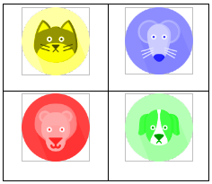

# Title

Attribfuscation: A New Class of Challenge-Response Authentication Systems

# Author

Mike Clark

# Abstract

In a *traditional* password system such as the numeric pinpad on most Automated Teller Machines (ATM), the user is presented with a challenge (i.e. the numerals 1 through 9 presented over a 3-by-3 grid), and the user must then enter the corresponding response (which is their secret/password). The correct secret is a successful response to the challenge presented, and a failure otherwise. However, this challenge-response password system suffers from attacks where an adversary can deduce the secret either directly (direct observation) or indirectly (physical indicators such as smudges or worn buttons). Once the adversary knows the secret, they can provide a valid response to the system. In other words, an adversary will know the password with absolute certainty after viewing the user enter their password once.

In this document, we propose a new challenge-response authentication (CRA) protocol and an implementation that uses the new protocol. The system allows for the adversary to have complete and full observations of a user's challenges and responses, yet there will still remain a calculable amount of uncertainty as to what the user's secret is. This property is leveraged to provide security against shoulder-surfing and smudge-like attacks.


# Threat Model

We propose an adversary who may have one or more, recorded or unrecorded observations of a user being presented with a challenge and entering the correct (with respect to the user's pre-chosen secret) response. The adversary is then presented with a challenge by the system and then attempts to enter the correct response based on the information that was derived from the (possibly multiple) challenge-response observations of the user being targeted. The system itself is public knowledge. The parameters of the system can be derived directly from viewing a challenge presented by the system.


# Background

## Challenge-Response Authentication Systems

A CRA is a protocol in which one party presents a challenge and the other party is authenticated by providing the correct response. Commonly, the challenge-response is set up to assert knowledge of some secret. For example, a password authentication protocol could be as follows:

A priori, the parties agree upon a shared secret (password). For this example, let the secret = `1234`.

A challenge could be: "What is the password?"
If the response was "1234", the responder would be authenticated.
Otherwise, they would not be authenticated.

You can define the secret-space of this example system as the set of all possible values that the response could be composed of. If we limited the secret to numeric values only, the secret-space would be the set: 
```
{1,2,3,4,5,6,7,8,9}
```

When implementing this example system, the party that is authenticating can be realized as a separate blackbox responsible for knowing the secret (password), generating a challenge (although sometimes we may have a fixed challenge), and authenticating based on a response to a given challenge with respect to the known secret. The party that is being authenticated can be realized as the user interface that a person interacts with. The user interface is responsible for presenting a challenge and generating a response based on user interaction with the interface for submission to the blackbox.

An example implementation of a numeric password authentication system is an ATM. Here, the user interface are the buttons you press when you enter your pin. The blackbox would be some remote system that authenticates against the users’ password that it has knowledge of. In this case, the challenge is static (I.e. the same arrangement of numeric buttons), so it would not need to be generated by the blackbox.

## Presentation Mapping

We could also construct a password authentication system using another type of object other than numerals in this system. For example, the secret-space could be pictures of animals, such that:

`secret-space = {cat, dog, mouse, lion, giraffe, zebra, tiger, snake, turtle}`.

And the challenge presented by the user interface would be a similar 3x3 grid, where each grid-square is occupied by one of the animals in the secret-space. The correct response to the challenge would be the sequence of animals comprising the secret (password).

In practice, you can generalize both of the aforementioned examples and we accomplish this by establishing a mapping between an enumeration (I.e. 0,1,2,3,4,...) and how to present the challenge digits. For the numeric password example we would establish the following mapping:

Value | Presentation
---|---
0 | ‘1’
1 | ‘2’
2 | ‘3’
3 | ‘4’
4 | ‘5’
5 | ‘6’
6 | ‘7’
7 | ‘8’
8 | ‘9’


And for the animal password example, we would establish the following mapping:


The blackbox does not need to have knowledge of the mapping. The blackbox will store the secret, generate challenges, and accept response input within the enumeration encoding domain. For example, it would store the password from the numeric example `('1','2','5','6')` as `(0,1,4,5)`. And it would expect that same format as a response from the user interface. Using the animal password example, it would store the password (cat,dog,giraffe,zebra) as (0,1,4,5). The user interface will be aware of the mapping and will generate the challenge in the presentation encoding (E.g. '1','2',... and dog,cat,...), however when it generates a response, it will map the user selection (E.g. cat,dog,giraffe,zebra) back to the enumeration (E.g. 0,1,4,5).

## Dynamic Challenge Generation
So far, we have only examined systems with static challenges. We will now consider systems where the challenge is generated by the blackbox. An example of this exists to combat smudge-attacks (whereby the attacker attempts to identify artifacts from the user interaction such as finger smudges or worn buttons to deduce the password), where the challenge consists of a 3x3 grid of the numerals 1 through 9. However, the numerals are permuted in a random ordering at each challenge (each time the user is asked to enter their password). For example, the blackbox might generate the following challenge `(3,8,1,5,2,0,6,7,4)`, which, using the numeric mapping (above) and laying out the digits in a row-wise fashion, it would look like (ignoring the top-row):


If the secret stored internally by the blackbox was `(0,1,4,5)`, an authenticated user will have selected the digits corresponding to `'1'`,`'2'`,`'5'`,`'6'` (middle-right, top-right, bottom-right, middle-left), and the user interface would have generated the response `(0,1,4,5)` by mapping the presentation encoding back to the enumeration, before submitting it to the blackbox for authentication. The blackbox would check and see that the response matches the secret, and authenticate the user.

# Proposed System

So far, we have provided a primer on existing CRA systems, so nothing here is new. We will now use this as background to discuss our proposed CRA protocol and implementation. We begin by defining a new secret-space composed of key-value pairs over two enumeration domains (we name key and value) of size we specify.

## Secret-space

Suppose we chose a key size of `2` and value size of `4`, this would result in the following secret-space populated with key-value pairs,

```
(0: 0), (0: 1), (0: 2), (0: 3), (1: 0), (1: 1), (1: 2), (1: 3)
```

Where we have used the notation "(KEY: VALUE)" (I.e. (0: 1) means value 1 of the zero'th key). Similar to before, the secret would be a sequence containing any of the elements from the secret-space (in this case, an element being a single key-value pair). For example, a secret of length four could be the following:

```
(1: 1),  (0: 3),  (1: 0),  (0: 1)
```

In addition to storing a secret as a sequence of key-value pairs, the blackbox generates challenges and the format of the response that it accepts from the user interface in a different manner. First, we will talk about how it generates challenges.Using the earlier secret-space (key size = `2`, value size = `4`), a challenge is generated by assigning a random element from each key to a digit the user can select on the challenge grid eventually rendered by the user interface.

### Challenge

An example challenge generated with this blackbox could be:

```
((0: 0), (1: 3)), ((0: 2), (1: 2)),
((0: 3), (1: 0)), ((0: 1), (1: 1))
```

Where the first digit's values are `0` and `3`, over the keys `0` and `1`, respectively.
Where the second digit's values are `2` and `2`, over the same keys.
Where the third digit's values are `3` and `0`, over the same keys.
Where the fourth digit's values are `1` and `1`, over the same keys.

In general, each response digit will contain one value for each key. And the number of elements comprising the challenge is equal to the size of the value set. 

### Presentation Mapping

This challenge is communicated with the user interface, which then applies a mapping from the enumeration encoding to the presentation. However, a mapping now exists for each key. For example, we will use a subset of the earlier animal mapping for the system described above (key size = `2`, value size = `9`) could be:


### User Interface (Grid Layout)

A user interface with a 2x2 grid layout would render the example challenge

```  
((0: 0), (1: 3)), ((0: 2), (1: 2)),
((0: 3), (1: 0)), ((0: 1), (1: 1))
```

, as,




A difference between our system and existing CRA systems is that when the user selects a digit from the challenge the response generated is the set of all key-value pairs for that digit and not just a single value or with respect to key values, not just a key_size of `1`. For example, if the user selected the image of the yellow cat, the corresponding response digit stored by the user interface would be `((0: 0), (1: 3))`; this is because in the 0'th-key mapping, the value for cat is 0. And in the 1'st-key mapping, the value for `yellow` is `3`. For example, the correct 4-digit response,

```
((0: 1), (1: 1)), ((0: 3), (1: 0)), ((0: 0),(1: 3)), ((0: 3), (1: 0))
```

would be generated by the user selecting (in order) the:

  `green dog`, `red lion`, `yellow cat`, and `green dog`.

### Response Validation & Well-formedness

The blackbox will be expecting a response in the same format as the challenge it generated (I.e. same key and value set size). The blackbox should only accept well-formed input, where well-formed input is defined as each response digit having a single value in the range of the value enumeration size for each key in the key enumeration. This would prevent attacks whereby the adversary would submit every key-value pairing in one submission. The blackbox could incorporate further security by allowing only key-value sets that were grouped together in the challenge. Using the running example, if the blackbox received a response with one of the digits being:

```
((0: 3), (1: 2))
```

would be rejected as because it was not well-formed, since those two key-value pairs were not one of the challenge digits:
```
((0: 0), (1: 3)), ((0: 2), (1: 2)),
((0: 3), (1: 0)), ((0: 1), (1: 1))
```
Or, expressed with respect to the animal presentation mapping, the blackbox would reject any response containing a `blue lion`, since the challenge being responded to does not contain a `blue lion`, but in fact contains a  `red lion`.

If well formed, the blackbox will then validate the response with respect to the known secret.

The blackbox will authenticate the response if, and only if,
   For each secret digit,
   		the secret's key-value pair is one of the key-value pairs in the corresponding response digit.

For example, using the secret from before,

```
(1: 1),  (0: 3),  (1: 0),  (0: 1)
```

, the correct response to the challenge above would be: 

```
((0: 1), (1: 1)),   ((0: 3), (1: 0)),   ((0: 0), (1: 3)),   ((0: 3), (1: 0))
```

This is because the first digit of the secret `(1: 1)` matches the key-value pair `(1: 1)` in the first response digit `((0: 1), (1: 1))`. Similar matches occur between each of the remaining secret and response digits.

From the user's perspective, they would be unaware of the internal enumerations and key-value pairs.
Here, they would know their secret as green, lion, red, dog (not by the internal enumeration in the language if the protocol that the blackbox operates on (I.e `(1: 1)`, `(0: 3)`, `(1: 0)`, `(0: 1)`) and the user would  respond by selecting the challenge digit containing that attribute (regardless of the other attributes in that digit, i.e. selecting the `green ______` because it's `green`, not because its a `______`). 

It should be noted that we have not discussed how the user chooses their (secret). This is because we are not proposing anything new or novel about that part of the system. For example, a traditional 1-9 pinpad would use the same grid for the user to interact with when setting their password. Similarly, a grid-layout could be used to present the entire secret-space (each key-value pair expressed in its presentation encoding, i.e. dog, cat, red, blue) for our proposed system. (Or whatever worked best, for a given implementation.)

The example we have shown, used a key enumeration size of 2 and value enumeration size of 9.  However, a key feature of the system is the parameterization of these two values. For example, by setting key_size to 1, value_size to 9, and setting a 3x3-grid user interface mapping to the numerals, we end up expressing a traditional 1-9 pinpad password system. On the other, in the included example (see external program), we setup the system with key_size = `3`. value_size = `9` and used a 3x3-grid user interface with the following mapping types for each key:

Key | Presentation
---|---
0 | shape (e.g. circle, square)
1 | shape colour
2 | shape border colour

The implications of adjusting the key and value set affects the amount of information revealed per challenge-response viewing to the adversary and is discussed more in the discussion section. (TODO hyperlink)

So far, we have shown user interfaces that utilize a grid layout, and present challenges by combining the multiple visual attributes. We will now discuss a different type of the implementation (user interface) that uses the same new blackbox and protocol we constructed earlier, a dial layout.

## Numeric Dial UI Implementation

The dial user interface interacts with the same blackbox described previously, with exception of how it interprets the challenge that the blackbox generates is different (I.e. laying each digit out around a ring as opposed to positions in a grid). A real-world example of this type of interface is the common combination lock, where the key size is `1` and the value size is however many positions/numbers there are around the ring on the face of the lock. Our implementation extends this to include multiple concentric rings (as many as there are keys), and populating the positions around the rings with the presentations mapped by the values of each key. The dial would have a fixed-positioned marker indicating the current challenge digit selection and the user would change what falls under this by an interaction where they rotate the rings to bring new values under the marker.

The table below illustrates an example interface of a system with key_size = `2`, value_size = `4`, and the following presentation mapping:

Key = 0 | (inner-ring) | Key = 1 | (outer-ring)
--- | --- | --- | ---
Value | Presentation | Value | Presentation
0 | ‘1’ | 0 | ‘1’
1 | ‘2’ | 1 | ‘2’
2 | ‘3’ | 2 | ‘3’
3 | ‘4’ | 3 | ‘4’

And the following challenge (generated by the blackbox),
```
((0: 2), (1: 0)), ((0: 1), (1: 2)), ((0: 3), (1: 3)), ((0: 0), (1: 1))
```


Similar to how the grid user interface was allowed to define an arbitrary procedure for assigning the challenge into the grid (top-left to bottom right, row-wise), the dial user interface example assigns challenge digits clockwise from the top position, although nothing would limit us from having a different challenge-digit distribution procedure. In the example implementation the red box outline overlaying the topmost position, represents the current digit ready for selection. It is selected by pressing the red, center button. However, nothing would limit some other interaction to “select” the digit (besides the red, center button).

The initial challenge-digit ready for selection (I.e. under the marker) would be `(inner-'3',outer-'1')`. If the user selected this digit (by some interaction, like pressing a button embedded in the presentation) then the user interface would map this back to the enumeration domain (as in previous examples) and store the response digit `(2: 0)`. The user could rotate the dial to have any of the other three digits fall under the marker. Once the user has built up their response digits, the user interface submits the response and it is processed as described earlier (I.e. checking key-value pair matches). From the user's perspective, they would be unaware of the internal enumerations and key-value pairs. Here, they would know their secret as a sequence of inner or outer ring numbers (E.g. `(outer-3,inner-2,outer-1,outer-1)`) and they respond to select that digit by rotating the dial until the number on the appropriate disc (inner or outer) falls under the marker. Similar to the grid examples, nothing would prevent other presentation mappings from being used such as, but not limited to, colors, shapes, animals positioned around the rings, as opposed to numerals.

The key and value size can also be parameterized, resulting in more/less concentric rings or objects (E.g. numbers, shapes) positioned around the rings, respectively. The mathematical implications of varying these values is discussed in the Mathematics section. It should also be noted that there is nothing preventing different ring movements when the user rotates the dial interface For example, when rotating clockwise, every odd ring rotates clockwise, whilst every even ring rotates counter-clockwise, resulting in adjacent rings rotating in the opposite direction.


## Blackbox: Sequential Challenge Mode

The numeric dial example above illustrates a potential usability issue caused by the way the blackbox generates challenges. Specifically, the numbers are in a random order around the ring. For humans, this would probably be more difficult to find their secret digit (number) on the rings compared to the numerals ordered. To accommodate this, we introduce a new mode of the blackbox (protocol), where the challenge is generated by selecting a random value for each key and setting that as the first digit of the challenge. From there, each successive digit of the challenge has a key-value pair whose value is the next sequential value after the previous value for each key. For example, generating a challenge with key_size = `2`, value_size = `4`:

1) We first pick a random value for each key of the first challenge digit. Here, `2` was chosen for the first key, and `0` for the second. This yields the following two key-value pairs for the first challenge digit:

	```
	((0: 2), (1: 0))
	```

2) The next digit challenge would then be the successor values for each key-value pair:

	```
	((0: 3), (1: 1))
	```


3) This would continue until every challenge digit (the same number as the value size) has been generated producing the following challenge:

	```
	((0: 2), (1: 0)), ((0: 3), (1: 1)), ((0: 0), (1: 2)), ((0: 1), (1: 3))
	```


Notice that from the second to third digit, the value for the zero'th key wraps from the max (3) back to 0.

The figure below illustrates a numeric presentation mapping of this example challenge. As you can see, this challenge generation mode will result in each ring having the numbers on them appear in their natural ordering, but the initial rotation of the rings, relative to each-other, will be random. The implications of having the blackbox in sequential challenge-mode are discussed in the Mathematics section.


## Blackbox: Relaxed Validation Mode

The numeric dial also illustrates a second potential mode for the blackbox. Recall that the user's secret in the dial example was "...a sequence of inner or outer ring numbers...".

We could have a second mode, where the secret is just a sequence of numbers, without ring positions. The user interface, the challenge generation mode (either sequential, as outlined in the previous section; or random, as outlined originally), and response-generation/submission (sequence of key-value sets) would remain the same. However, we would need to have a new mode available for the blackbox, which we will call "relaxed validation mode".

The original blackbox validation mode discussed so far, checks that, for each digit in the secret, that  digit's key-value pair existed in the corresponding response digit being submitted for validation. The new mode differs in that the secret is now a value, which is then checked for the existance in any of the key-value pairs for the corresponding response digit. For example, we use the dial layout with the marker over the top-most position and the rings moving in the same direction of rotation relative to each other.

Suppose we are in sequential challenge generation mode, and the key_size = `2`, value_size = `4`, and the same challenge shown in  the preceeding figure is generated:

```
  ((0: 2), (1: 0)), ((0: 3), (1: 1)), ((0: 0), (1: 2)), ((0: 1), (1: 3))
```

For the sake of brevity, we will use the following secret of two digits in length,:
```
(0,1)
```
Notice these are just values, not key-value pairs.

For this challenge-secret, we could generate four valid responses
1)	`((0: 2), (1: 0))`, `((0: 3), (1: 1))`
    - the dial is already in a position where the outer-ring has the 0 value in the top-most position, press the select digit area.
    - rotate the dial 90 degrees counter-clockwise to have the outer-ring's 1 value in the top-most position, press the select digit area.
    
2) `((0: 2), (1: 0))`, `((0: 1), (1: 3))`
    - the dial is already in a position where the outer-ring has the 0 value in the top-most position, press the select digit area.
    - rotate the dial 90 degrees clockwise to have the outer-ring's 1 value in the top-most position, press the select digit area.

3) `((0: 0), (1: 2))`, `((0: 3), (1: 1))`
    - rotate the dial 180 degrees to have the inner-ring's 0 value in the top-most position, press the select digit area.
    - rotate the dial 90 degrees in clockwise to have the outer-ring's 1 value in the top-most position, press the select digit area.

4) `((0: 0), (1: 2))`, `((0: 1), (1: 3))`
    - rotate the dial 180 degrees to have the inner-ring's 0 value in the top-most position, press the select digit area.
    - rotate the dial 90 degrees in counter-clockwise to have the inner-ring's 1 value in the top-most position, press the select digit area.

Generally speaking, for the relaxed-mode it is most usable when the mappings for each key are similar (I.e. the second value of every key maps to the same object rendered, such as the numeral 2). This way they need only remember that single value mapped, and not what is presented as the second value for each key. However, nothing would prevent the use of dissimilar mappings in this mode. For example, perhaps the second value of each key is an image belonging to some category (E.g. electronic device, animal, flag). In this scenario, the user would remember the category and not have to remember every element in the category mapped to by a keys value.


# Discussion

When we introduced our proposed CRA protocol, we left out how one would implement setting the secret known by the blackbox since this could be done any number of ways. It should be noted that nothing theoretically would prevent the user interface and blackbox to coexist as the same code module, regardless, it is easier to rationalize and reason about them as two separate entities.

In practice the system would be set by the developer to some key and value size, presentation mapping, and challenge-generation and blackbox validation mode. The system itself (I.e. key/value size, presentation mapping, user interface, blackbox modes enabled/disabled) is public knowledge, only the secret is withheld from the adversary.


In the best-case, after one viewing the adversary will be presented with a challenge in which none of the challenge digits have common attributes from the initial viewing. In this case, the probability of success (per digit) is `1/(key_size)` and is independent of the `value_size`.
For example, using an implementation with a `key_size=3` and `value_size=9` and a 1-digit secret:
- After 0 viewings the probability of the adversary correctly guessing the secret is `1/9`
- After 1 viewings the probability of the adversary correctly guessing the secret is `1/3`, since he will have viewed one response and will know that the secret is one of the three key-value pairs.
...
The mathematics is described in more detail and an attempt to derive a formula is available in the ['Theory'](../theory/) directory.
In general, increasing the `value_size` increases the entropy of the system with 0 viewings, whilst increasing the `key_size` increases the entropy after one, or more, viewings.

The system does not provide a large magnitude of viewings before the adversary has a better than 50% probability of correctly guessing the secret. For this reason, the main application would be where contact with the adversary is incidental. For example, if you were at a bar and unlocked  your phone  to check messages before going to the washroom, a stranger that was sitting next to you at the bar would not be able to know your password. And since the phone rate limits password attempts it would be difficult for the adversary Another use case would be an ATM. In this case the chance of the skimmer/camera viewing you enter multiple times before being discovered is probably fairly low.

This system would also benefit from the possible difficulty in the adversary getting a clear view (short of recording) of the challenge-response (I.e. they can’t make out or remember exactly what all of the attributes were for a particular object selected by the user on the interface) -- this is in addition to the previously explained security afforded after complete and full observations by an adversary.

Throughout the examples, the number of challenge digits (I.e. positions on the dial disc’s, grid squares on the grid layout) was equal to the number of values each key can take on. This guarantees that every key-value pair will occur once, and only once, in a single challenge digit. There is nothing limiting us from choosing larger challenge-digits, such that some challenge-digits are empty, or that some have only values for some keys.

The presentation mappings is another important part that should not be limited. In our grid examples, we used numerals, colours, shapes, animals; however, each key could be presented as anything that was distinguishable. Furthermore, the presentation mappings do not necessarily have to correspond to a static visual feature (E.g. colour, animal), but could also be extended to include things such as animation (E.g. rotating left, rotating right, undulating).

It is important to note that the user interface’s presentation in, and of itself, does not constitute novel, original work. (E.g. coloured animals). It is  the protocol over which the user interface interacts with the black box in conjunction with the user interface, which realizes something novel.


# Related Work

There exists systems in literature that try to obstruct an adversaries viewing of a challenge-response. An example, is one where the phone vibrates and the user responds differently to the challenge depending on the number of pulses of vibration. In this case, the adversary does not have a way to feel the vibrations, and therefore is not really viewing a complete challenge-response – only a partial response (what he can see the user interact with on-screen).   
To my knowledge, there exists no CRA systems in literature that define the protocol we have proposed.

# Conclusion

In this document, we introduced the idea of a challenge-response authentication (CRA) protocol and walked through examples of existing systems, while defining terminology used in this domain. We proposed a new protocol whereby the secret space is composed of key-value pairs, each response digit is composed of groupings of key-value pairs (one for each key) and authentication occurs by checking for the existence of the secret-digit's key-value pair in the set of key-value pairs in the corresponding response digit. We discussed an alternative authentication mode whereby a response digit is valid if any of the values in the key-value pairs matches the value for the corresponding secret digit.

We also discussed an alternative challenge-generation mode whereby the challenge can be made to fit a certain pattern (sequential values per key). We alluded to mathematical formula derived for calculating the entropy (uncertainty) preserved after viewings by an adversary and discussed the general affects of the different system parameters on the uncertainty. Finally, we discussed some of the  applications of the system, absence of limitations, and related work.