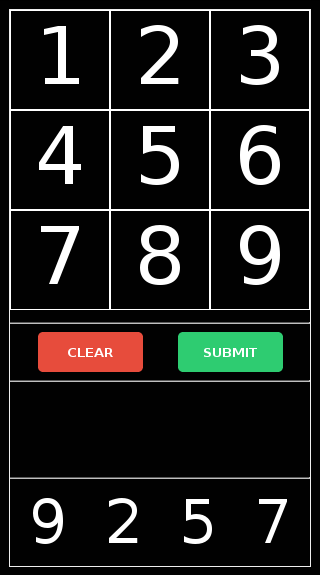
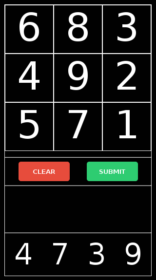
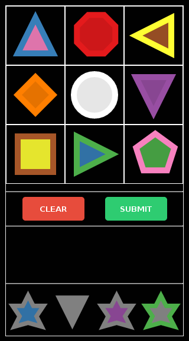
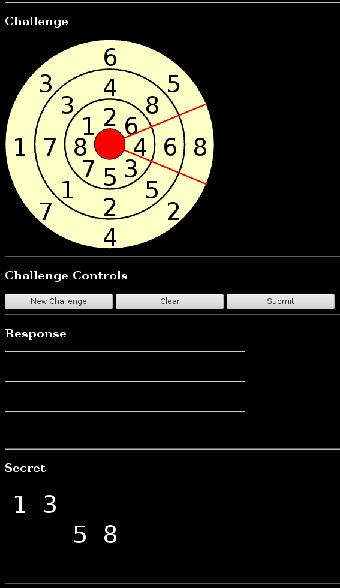

# Challenge-Response Study Framework
 
A framework for rapidly prototyping new challenge-response systems, their visual presentation, and autonomously conducting
usability studies.

This framework allows us to realize traditional challenge-response systems (e.g. numeric pinpad), as well as
attribfuscation-based systems as described in the master [README](../README.md) and conduct a usability study with the
implementations.


# Installation

## Requirements

- Web Server (e.g. NGINX, APACHE) with PHP support
- Python => 2.7 (software/util/EventDecoder_*.py)
- PHP => 4.3 (software/www/dataMuncher.php)

## Steps

1) Create a root directory (`DOCROOT`) accessible to the web-server and copy files into it:

	```bash
	mkdir $DOCROOT
	cp -r software/www/* ${DOCROOT}/
	```

2) Make files and directories world-accessible:

	```bash
	chmod o+r-wx ./* css/* img/* js/* template/*
	chmod o+x-wr . css img js template
	```

3) Create randomly-named data directory and set permissions:
	
	```bash
	DATA_DIR="data.$(cat /dev/urandom | tr -dc 'a-zA-Z0-9' | fold -w 32 | head -n 1)"
	mkdir "$DATA_DIR"
	chmod u+rwx,g-rwx,o+xw-r "$DATA_DIR"
	```
	(1st line of code snippet from: https://gist.github.com/earthgecko/3089509)

4) Construct an `.htaccess` file for an extra layer of protection on the data files and set permissions on it:

	```bash
	cat << EOF > "$DATA_DIR/.htaccess"
	<FilesMatch ".(htaccess|dat|log)$">
	Order Allow,Deny
	Deny from all
	</FilesMatch>
	EOF
	chmod u+r-wx,g-rwx,o+r-wx "$DATA_DIR/.htaccess"
	```

5) Set undefined variables:

	```bash
	REF_URL="https://example.com/docroot/"
	sed -i 's|INSERT_VALID_DATADIR|'$DATA_DIR/'|' dataMuncher.php
	sed -i 's|INSERT_VALID_REFERER|'$REF_URI'|' dataMuncher.php

	SYSADMIN_EMAIL=you@example.com
	sed -i 's|INSERT_EMAIL_ADDRESS|'$SYSADMIN_EMAIL'|' js/Common.js
	```

	*Note: `REF_URL` should be the path to `survey.html` (needs trailing path-separator)
		Paths **must** contain a needs trailing path-separator.*

6) [OPTIONAL] Remove any unneeded HTML front-ends:

	If you are setting up an actual study, you would most likely remove the standalone front-ends (`gridShape.html`, `gridNumeric.html`, and `dial.html`), and modify
	the landing page (`index.html`) to your taste and have it then link to `study.html`.

	```bash
	REF_URL="https://example.com/docroot/"
	sed -i 's|INSERT_VALID_DATADIR|'$DATA_DIR/'|' dataMuncher.php
	sed -i 's|INSERT_VALID_REFERER|'$REF_URI'|' dataMuncher.php

	SYSADMIN_EMAIL=you@example.com
	sed -i 's|INSERT_EMAIL_ADDRESS|'$SYSADMIN_EMAIL'|' js/Common.js
	```


# Front-ends

## Standalone
The standalone front-ends include controls to change the settings (e.g. key size and value size) of the implementation.

### Numeric Grid

[`gridNumeric.html`](www/gridNumeric.html)

A numeric grid challenge-response system, the on-page controls can be used to set the challenge mode.

Fixed (similar to a traditional pinpad)



, or randomly permuted.



### Shape-Colour-Colour Grid

[`gridShape.html`](www/gridShape.html)

A version of the Shape-Colour-Colour challenge-response system based on the principles of attribfuscation.



### Numeric-Numeric-Numeric Dial

[`dial.html`](www/dial.html)

A version of a numeric dial challenge-response system based on the principles of attribfuscation.




## Unified

The unified front-end is meant to be used as framework for autonomous usability studies on arbitrary challenge-response systems.

### Study

[`study.html`](www/study.html)

A complete study. It includes training and evaluation sections for a static numeric grid, random numeric grid, and a shape-colour-colour systems.
The study also includes a interactive consent form and survey. Telemetry is available that can record
the mouse movements, clicks and events (such as entering a challenge-digit or submitting a response to a challenge).
Telemetry is discussed in more detail later in this document.


# Libraries<a name="Libraries"></a>
The libraries for the core of the framework. A brief explanation of each is provided below, however, each
is extensively documented in their respective source code file; refer there for more details.

## Common

[`Common.js`](www/js/Common.js)

This contains variables shared across the framework libraries.
It contains user-defined variables at the top that can be modified to suit your needs.
The `EMAIL_SYSADMIN` variable is set to a meaningless placeholder and should be set to the email address 
you want to show the user when a fatal error occurs so that they can notify you.

## Session

[`Session.js`](www/js/Session.js)

This is responsible for coordinating a session, where each *session* is composed of one, or more, *sections*. 
It reads a [domain-specific scripting language](../docs/format.txt) from a [`manifest`](../www/template/study.manifest), which allows the developer to describe a *session* and it's *sections*.

Each section can describe either a:
- challenge-response system, or
- web form.

The language also allows us to describe the terminating conditions for the section (time-based, or based on a count or run of wins, losses). 

Web forms and other regular web pages can be used in sections (this allows us to provide instructions and surveys).
Sections are run sequentially in the order of appearance in the `manifest` file. and each section is handled by a newly-instantiated `Controller` (parameterized by the specifications of the section description  in the manifest).

## Controller

[`Controller.js`](www/js/Controller.js)

Instantiates and manages the `BlackBox`, `UserInterface`, and `Telemeter` based on the manifest parsed by the `Session`, as well as coordinating between them.
In a standalone implementations, this is instantiated directly in the loader of the front-end HTML file (as opposed to by the `Session`).

This currently recognizes three UI-type manifest declarations:

- Numeric grid:

	This presents BlackBox enumerations as Arabic numerals displayed in a grid pattern. It is used for both the static and random numeric grid implementations.

- Shape-colour-colour grid:

	This presents enumerations as SVG objects, whose attributes (e.g. shape, colour) map to the BlackBox enumerations displayed in a grid pattern. It is used for both the Shape-Colour-Colour implementations.

- Numeric dial:

	This presents BlackBox enumerations as Arabic numerals positioned around concentric rings. displayed in a grid pattern. It is used for both the Shape-Colour-Colour implementations.
	
- Other:

	This uiType allows you to scrape data from arbitrarily composed HTML forms. This allows us to use the existing telemetry infrastructure to collect form data such as [surveys](www/template/survey.htm) or [consent forms](www/template/consent.htm).

	To be recognized, a form to be scraped must have `name='otherDataForm'` and `id='otherDataForm'`.
	
	The HTML file **must** include:
		- a hidden input with a `name='otherDataValidHidden'` and `id='otherDataValidHidden'`.
		(This is used to communicate with the back-end libraries without the HTML document needing to know about the back-end/)

	The HTML file **may**  include:
		- an HTML input button with `name='submitResponseButton'` and `id='submitResponseButton'` to act as a `ACK` response when clicked,
		- An HTML input button with `name='clearResponseButton'` and `id='clearResponseButton'` which will cause a `NAK` response when clicked.

	The form elements can have any name/id that does not conflict with the form name or each other.
	Any restrictions placed on input elements (e.g. min,max values, maxLength) will
	be verified when the acknowledgment (`ACK`) button is pressed, if there are invalid form elements,
	submission will not proceed.

	The data captured in the forms is a newline-delimited list of key-value pairs (for each form element), `UTF-8` encoded and stored in
	the event logs as type `EVENT_TY_OTHERDATA`. (See [`formats.txt`](docs/formats.txt) for more details.) 


## BlackBox

[`BlackBox.js`](www/js/BlackBox.js)

Handles requests to generate and set a new secret, generate a new challenge, and validate a challenge-response based on the current internal secret set.
It can be parameterized for different `key` and `value` sizes, as well as how the challenge is generated. It stores internal state and communicates externally using enumerations (decoupling the presentation and meaning from the enumeration values).

## UserInterface

[`UserInterface.js`](www/js/UserInterface.js)

This superclass is responsible for managing the visual interface, as well as user interaction with that interface. 

It currently has three subclasses:

- [`UserInterfaceDialChallenge.js`](www/js/UserInterfaceDialChallenge.js)
	which is responsible for the dial challenge UI

- [`UserInterfaceDialSecret.js`](www/js/UserInterfaceDialSecret.js)
	which is responsible for the dial secret UI

- [`UserInterfaceGridChallenge.js`](www/js/UserInterfaceGridChallenge.js)
	which is responsible for the grid challenge and secret UI

In all three cases, the challenge UI is what shows the challenge and accepts a response, while the *secret* is the UI for selecting a secret.

## KeyVal

[`KeyVal.js`](www/js/KeyVal.js)

This realizes the key-value pairs in the system as visual effects. (e.g. numbers, shapes, colours) and placement. This allows us to rapidly prototype new, or extend existing, visualizations. (See the documentation within the source file for more details on how the inner workings.)

## Telemeter<a name="telemeter"></a>

[`Telemeter.js`](www/js/Telemeter.js)

This is responsible for capturing user data, such as mouse movements, interactions with the UI. It can also capture arbitrary form data. 
The data is stored in a packed, custom binary data format (See [`formats.txt`](docs/formats.txt) for more details).
It can be enabled/disabled on a per-section basis in the manifest file. The manifest can also direct how the captured data is stored at the conclusion of the study: locally, remotely, or not at all.

# Telemetry Capture and Storage

[`dataMuncher.php`](www/dataMuncher.php)

Upon completion of the study (after all sections have been traversed), the Session will POST to this script.
The body will contain the packed, binary telemetry data with metadata relating to the sections to which they belong.

Upon deployment, you need to set user-defined variables found at the beginning of `dataMuncher.php`
Two are unset and will cause the script to fail.
  $validReferer = 'INVALID';
  $dataDir = 'INVALID'; // this preexisting folder should have `o+wx` Linux file permissions set
The remainder of the user-defined variables are set to default values and may be modified to suit the deployer's needs

Within the PHP configuration file (`php.ini`), the `max_post_size` and `upload_max_filesize` should be increased to accommodate the magnitude of data generated,
Each Telemeter event record occupies 4B, then assuming a *very* liberal 1 event per ms, this is ~ 14 MB for a 30 min session. In normal usage, this rate is often much smaller.

The script also contains checks on the `referer` request header field of the HTTP request to throw up a minor roadblock to adversaries spamming `datamuncher.php` with requests not generated by us.
No error is given if the referer is invalid and this is part of a strategy to throw up a minor (but easily surmountable roadblock) for an adversary trying to spam the script with illegitimate data not generated by us.
The script also checks to ensure that it is being communicated with over HTTPS.
If either of theses checks fail (incorrect referer or non-https connection), no data is written and the script silently errors, returning a HTTP status `200` as to not indicate anything to any possible adversaries. Internally, the error is logged to the private logfile (`dataMuncher.log`). If you wanted to have greater security, CSRF tokens could be implemented to increase the resources required by an adversary to spam the server.

As output, the script will generate a filename based on the hash of the current server time, remote address, user agent and request time, as well as a random number. If this file cannot be opened, the script will attempt to append the data to the end of a preexisting backup file (`lost.dat`).

All data files generated have all of their permissions **unset** for confidentiality, in addition to an `.htaccess` file control. Although this works fairly well in preventing an adversary from reading/writing to data files generated, a race condition exists between laying down the data and when the permissions are changed which (in theory) could be exploited by an adversary to gain access to a data file. However, they would need to know the name (which is a fair-sized pseudo-random hash value) and attempt retrieval during an extremely small window. For our purposes, this will suffice.

The formating for the data files is shown in [`formats.txt`](docs/formats.txt).

By default, errors are logged to `$DATA_DIR/dataMuncher.log`. This destination can also be changed in the script.


# Output Data Post-Processing

To decode the packed binary data, we implemented two versions of a decoder to decode the data to ASCII.

`EventDecoder_Standalone.py`

This is used to decode telemetry data from standalone (non-sessions), such as `gridShape.html`, `gridNumeric.html`, and `dial.html`.

`EventDecoder_Study.py` 

This is used to decode telemetry data from unified (session), such as `study.html`.

The EventDecoders requires Python => 2.7.

## Running
When run under Python, UTF-8 encoding should be set.
Thus, running the study decoder on a file `output.dat` output by the dataMuncher would look like this:

```bash
PYTHONIOENCODING=utf-8 python EventDecoder_Study.py output.dat
```

The output data begins with a session header and is then divided by section. Each section has a header and three contiguous data buffers each containing a different type of data
recorded:
1) Mouse movement events
2) User-generated events
3) System-generated events

To clean this up and provide a single event log, ordered by timestamp, we add line numbering 
Taken together, we can generate  a line-numbered, and formatted version of `output.dat` using the following command:

```bash
PYTHONIOENCODING=utf-8 python  EventDecoder_Study.py output.dat |\
awk -F ',' '{tp = $2; $2 = $1; $1 = sprintf("%010d", NR); print tp,$0};' | sort
```

The output will also contain humans-readable logs, as well as machine readable. They can be filtered out with the grep command as desired.

# Known Issues

- The Telemeter does not capture the system parameters in standalone mode.
	Workaround: use the session id/name to encode the info you need from the parameters.

- There is an approximate 5 ms delay from when an event occurs to when it is timestamped.
	Justification: This is because the some events are timestamped wrt the page load whilst others are wrt the UNIX timestamp. To reconcile this, we just re-stamp every page-load-relative timestamp using the UNIX epoch as a basis at the expense of a small shift in the time domain.

# Further Readings

The source code contains extensive comments which goes into greater detail with respect to implementation.


